# Active Directory Identity Lifecycle Management (JML) & RBAC

**Windows Server 2025 · Active Directory Domain Services · PowerShell · Hyper-V · NTFS**

A hands-on IAM project demonstrating identity provisioning, role-based access control, Joiner-Mover-Leaver lifecycle administration, least privilege, privilege-creep detection, access validation, and secure offboarding in the `arthurlab.test` domain.

Portfolio documentation | September 2026

---

## Project Overview

- **Environment:** Windows 11 Pro host, Hyper-V, Windows Server 2025 VM named `DC01`.
- **Domain:** `arthurlab.test` (NetBIOS: `ARTHURLAB`). DC01 also provides DNS.
- **Identity structure:** ArthurLab Users with Finance, Human Resources, IT, and Sales OUs; separate ArthurLab Groups, ArthurLab Computers, and ArthurLab Disabled Users OUs.
- **Primary scenarios:** Sarah Johnson (Joiner and Mover) and Michael Davis (negative access test and Leaver).
- **Security model:** Global security groups, group-based NTFS permissions, least privilege, effective-access validation, and PowerShell verification.

**Portfolio outcome:** the project models a small enterprise IAM workflow — create identities, assign role-based access, validate authorization, detect stale entitlements after a role change, remediate privilege creep, and securely disable and segregate a departing identity.

All PowerShell commands referenced below are consolidated in [`scripts/identity-lifecycle-rbac-audit.ps1`](scripts/identity-lifecycle-rbac-audit.ps1).

---

## 1. Lab Infrastructure and Domain Deployment

**Step 1 — Hyper-V VM provisioning.** Created the DC01 Generation 2 virtual machine in Hyper-V with a dynamically expanding VHDX, two virtual processors, and the Hyper-V Default Switch.

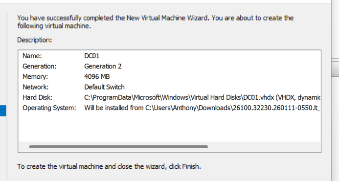

**Step 2 — Windows Server 2025 installation.** Installed Windows Server 2025 Standard Evaluation (Desktop Experience) from ISO and completed the initial server setup.

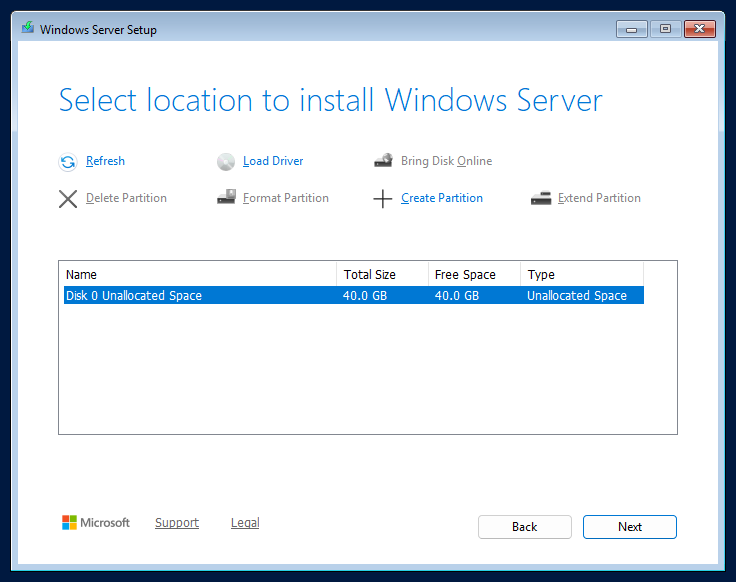

**Step 3 — AD DS and DNS role installation.** Installed Active Directory Domain Services and DNS Server, then prepared the server for promotion to a domain controller.

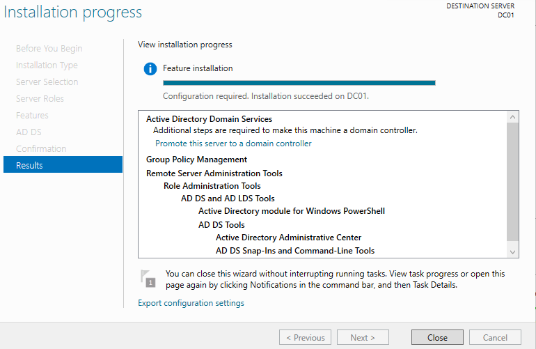

**Step 4 — New forest and domain.** Promoted DC01 to a domain controller and created the new forest `arthurlab.test`. DNS and Global Catalog functionality were enabled.

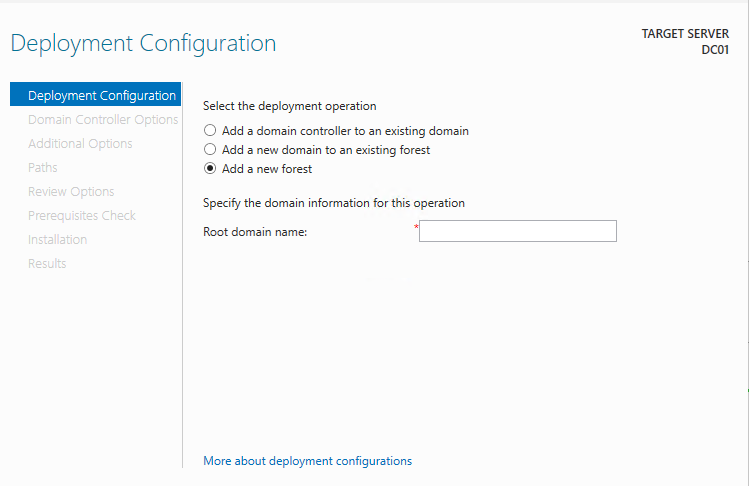

**Step 5 — Domain validation.** Validated the domain, forest, domain controller, and DNS resolution with Active Directory PowerShell cmdlets and `nslookup`.

```powershell
Get-ADDomain
Get-ADForest
Get-ADDomainController
nslookup arthurlab.test
```

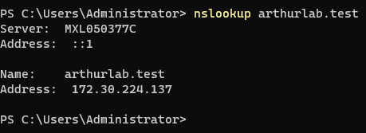

---

## 2. Organizational Unit and RBAC Design

**Step 6 — OU structure.** Created a departmental OU hierarchy to separate identities by business function and created dedicated containers for groups, computers, and disabled users.

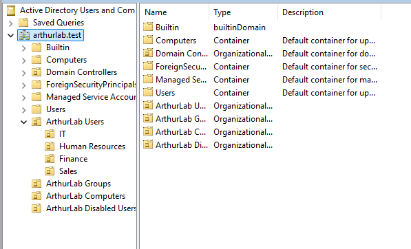

**Step 7 — Role-based security groups.** Created global security groups including `GG-Finance-Users` and `GG-HR-Users`. Access was assigned to groups rather than directly to individual users.

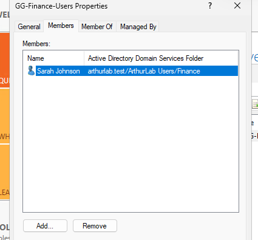

---

## 3. Joiner Workflow — Sarah Johnson

**Step 8 — Provision identity.** Created Sarah Johnson (`sjohnson`) as a Finance user, populated role attributes, required a password change at first sign-in, and placed the account in the Finance OU.

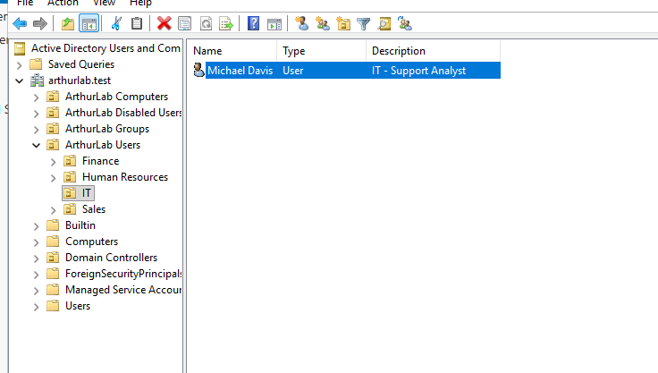

**Step 9 — Assign Finance entitlement.** Added Sarah to `GG-Finance-Users` and verified the resulting group membership with PowerShell.

```powershell
Get-ADUser sjohnson -Properties MemberOf | Select-Object Name,UserPrincipalName,Enabled,MemberOf
Get-ADGroupMember "GG-Finance-Users"
```

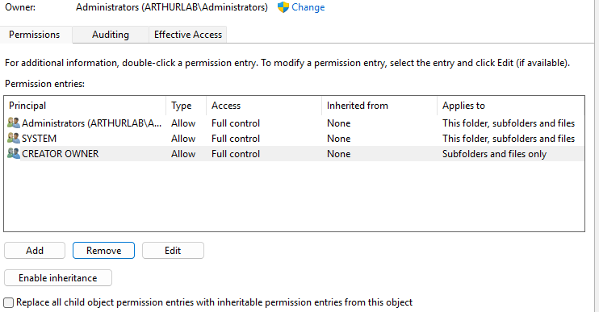

**Step 10 — Configure Finance resource access.** Created `C:\FinanceData`, disabled inherited permissions, removed broad Users access, retained administrative/system entries, and granted `GG-Finance-Users` Modify permission.

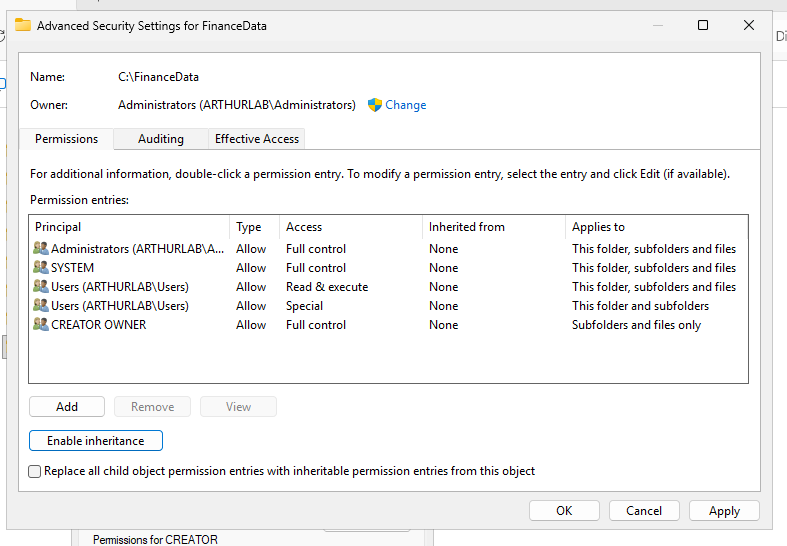

**Step 11 — Validate least privilege.** Used Effective Access to verify that Sarah received the expected Modify-style permissions without Full Control, Change Permissions, or Take Ownership.

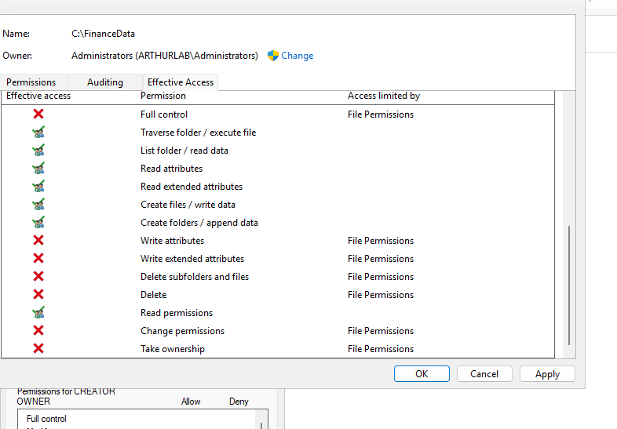

---

## 4. Negative Authorization Test — Michael Davis

**Step 12 — Provision IT identity.** Created Michael Davis (`mdavis`) in the IT OU as an IT Support Analyst. He was intentionally not granted Finance membership.

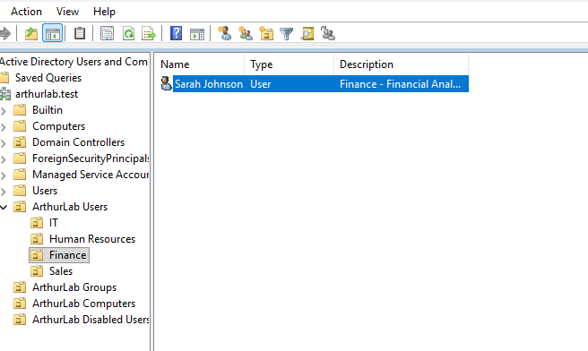

**Step 13 — Verify denied Finance access.** Validated that Michael was only a Domain Users member and had no effective access to `C:\FinanceData`, demonstrating least privilege and negative authorization testing.

```powershell
Get-ADPrincipalGroupMembership mdavis | Select-Object Name
Get-ADGroupMember "GG-Finance-Users"
```

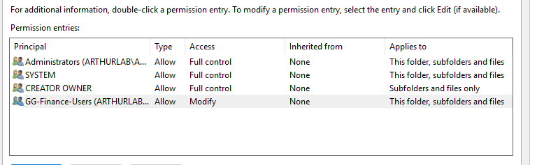

---

## 5. Mover Workflow — Finance to Human Resources

**Step 14 — Move Sarah to HR.** Moved Sarah from the Finance OU to Human Resources and updated her title and department to HR Analyst / Human Resources.

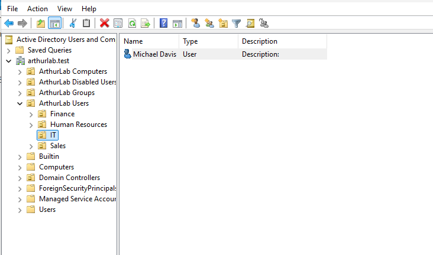

**Step 15 — Detect privilege creep.** Reviewed Sarah's group memberships after the department transfer and intentionally observed that `GG-Finance-Users` remained assigned — stale access / privilege creep.

```powershell
Get-ADPrincipalGroupMembership sjohnson | Select-Object Name
```

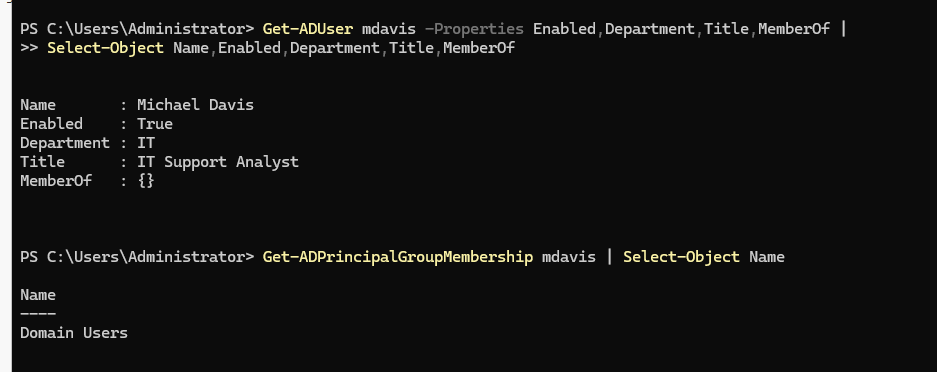

**Step 16 — Remediate entitlements.** Removed the obsolete Finance group and added the correct HR role group, then re-ran group membership validation.

```powershell
Remove-ADGroupMember -Identity "GG-Finance-Users" -Members sjohnson
Add-ADGroupMember -Identity "GG-HR-Users" -Members sjohnson
Get-ADPrincipalGroupMembership sjohnson | Select-Object Name
```


**Step 17 — Configure HR resource.** Created `C:\HRData` and assigned `GG-HR-Users` Modify access using the same least-privilege group-based model.

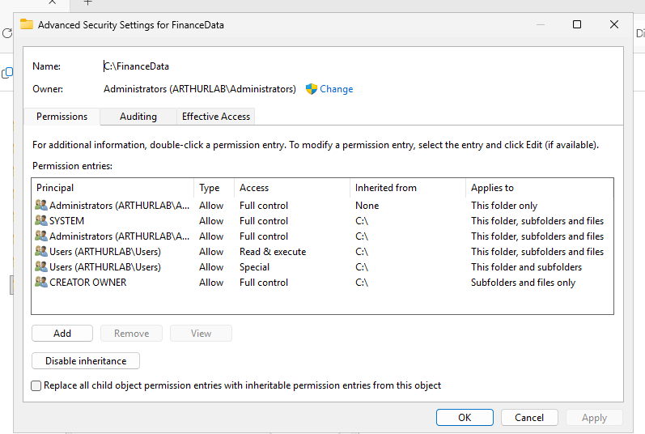

**Step 18 — Validate access transition.** Confirmed Sarah no longer had FinanceData access and did have HRData access. This verified successful revocation of old access and provisioning of new access.

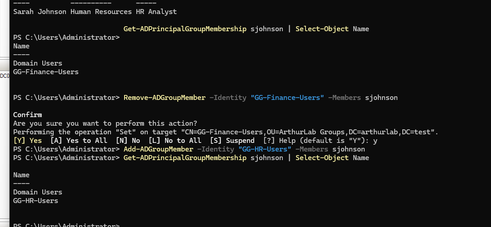

---

## 6. Leaver Workflow — Michael Davis

**Step 19 — Establish offboarding baseline.** Reviewed Michael's account state, role attributes, and group memberships before offboarding. The account was enabled and retained only the baseline Domain Users membership.

```powershell
Get-ADUser mdavis -Properties Enabled,Department,Title,MemberOf | Select-Object Name,Enabled,Department,Title,MemberOf
Get-ADPrincipalGroupMembership mdavis | Select-Object Name
```

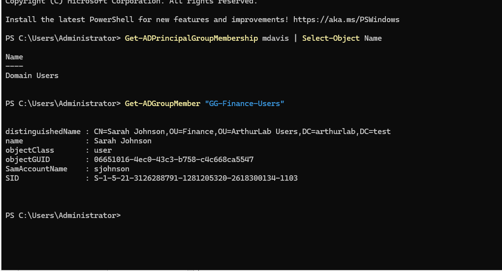

**Step 20 — Disable the account.** Disabled Michael's AD account with PowerShell and verified `Enabled = False`.

```powershell
Disable-ADAccount -Identity mdavis
Get-ADUser mdavis -Properties Enabled | Select-Object Name,SamAccountName,Enabled
```

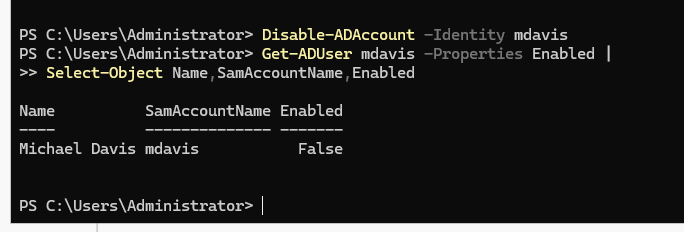

**Step 21 — Segregate disabled identity.** Moved Michael from the IT OU to ArthurLab Disabled Users to keep inactive identities separate from active departmental accounts.

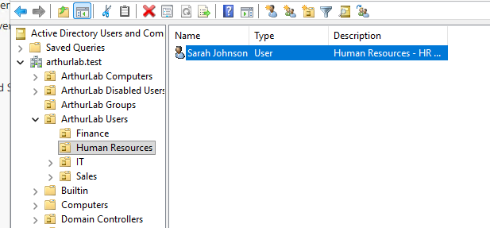

**Step 22 — Final offboarding validation.** Verified the account remained disabled, preserved role metadata and `LastLogonDate` for audit context, and retained only Domain Users.

```powershell
Get-ADPrincipalGroupMembership mdavis | Select-Object Name
Get-ADUser mdavis -Properties Enabled,Department,Title,LastLogonDate | Select-Object Name,Enabled,Department,Title,LastLogonDate,DistinguishedName
```

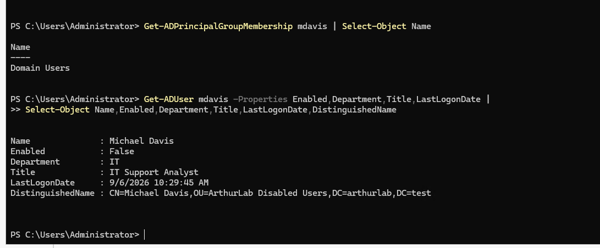

---

## 7. Key Commands and Administrative Notes

| Purpose | Command / cmdlet |
|---|---|
| Domain validation | `Get-ADDomain`; `Get-ADForest`; `Get-ADDomainController`; `nslookup arthurlab.test` |
| Identity review | `Get-ADUser -Properties ...` |
| Group review | `Get-ADPrincipalGroupMembership`; `Get-ADGroupMember` |
| Entitlement remediation | `Remove-ADGroupMember`; `Add-ADGroupMember` |
| NTFS review | `(Get-Acl "C:\FinanceData").Access \| Format-Table IdentityReference,FileSystemRights,AccessControlType` |
| Offboarding | `Disable-ADAccount -Identity mdavis` |

**Operational note:** Hyper-V checkpoints were intentionally avoided unless necessary because previous checkpoint files consumed significant storage. Normal guest shutdown preserves the VM state on the VHDX.
